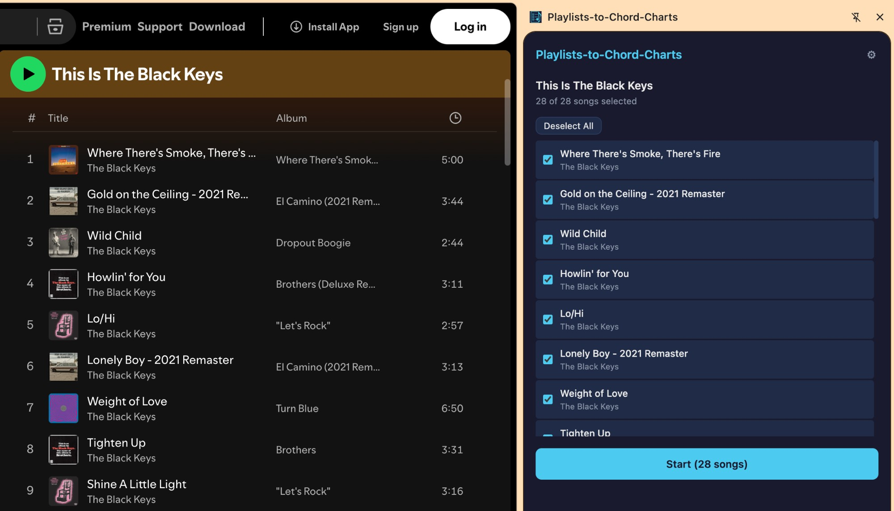
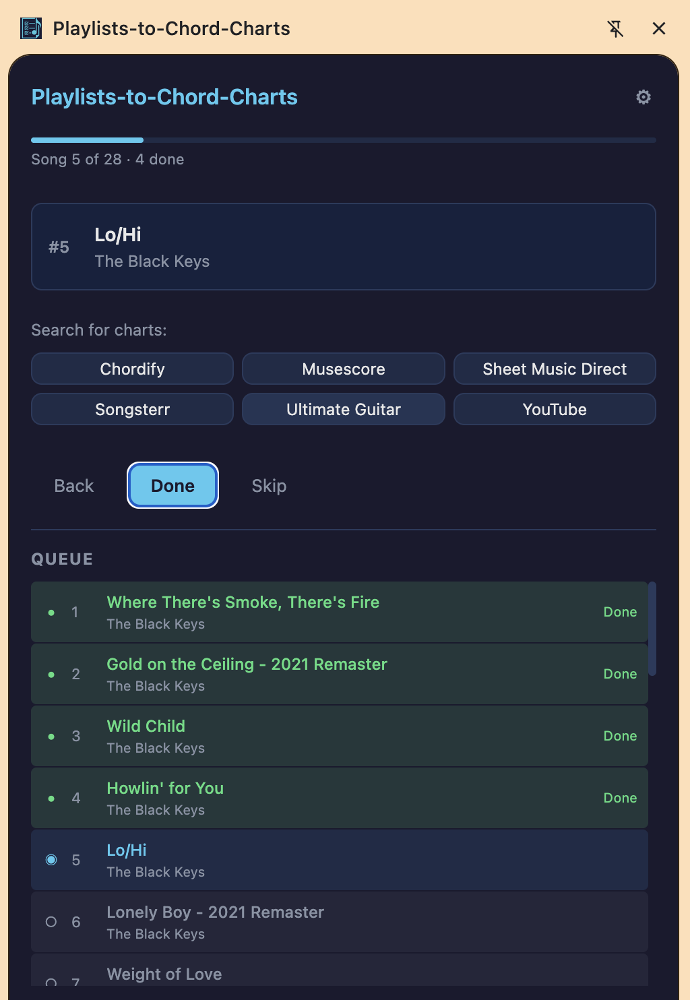

# Playlists-to-Chord-Charts

Chrome extension that extracts playlists from music streaming services and helps you find chord charts, tabs, and sheet music for each song.

Open a playlist, click the extension, and step through each song with one-click search buttons for multiple chart providers.





## Supported Playlist Sources

- Spotify
- Apple Music
- YouTube Music
- YouTube
- Tidal

## Supported Chart Providers

- Ultimate Guitar
- Chordify
- Songsterr
- Musescore
- Sheet Music Direct
- YouTube

## Install

### From release (no build required)

1. Download the latest ZIP from [Releases](https://github.com/michaeljancsy/chord-chart-getter/releases)
2. Unzip it
3. Go to `chrome://extensions` and enable **Developer mode**
4. Click **Load unpacked** and select the unzipped folder

### From source

```sh
git clone https://github.com/michaeljancsy/chord-chart-getter.git
cd chord-chart-getter
npm install
npm run build
```

Then load the `dist/` folder as an unpacked extension.

## Usage

1. Open a playlist on any supported music service
2. Click the extension icon to open the side panel
3. Click **Detect Playlist** to extract the track list
4. Select which songs to include and click **Start**
5. For each song, use the search buttons to open chart sites
6. Mark each song **Done** or **Skip** to move to the next one

You can click any song in the queue to jump to it, and toggle completed songs between Done and Skipped.

## Development

```sh
npm run dev      # watch mode
npm run build    # production build to dist/
npm test         # run tests
```

## Architecture

- **Manifest V3** Chrome extension with a service worker background script
- **Preact + Vite** side panel UI with `@preact/signals` for state management
- **Content scripts** injected on-demand to extract playlist data from each music service
- **Message-passing** between side panel, service worker, and content scripts

## License

MIT
